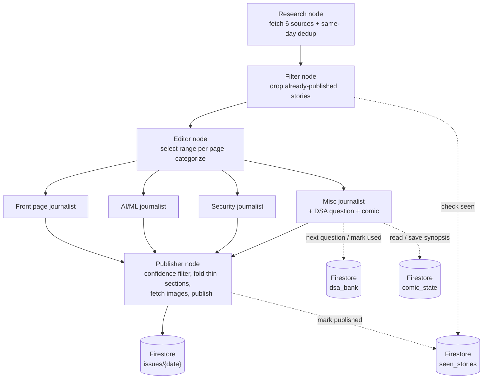

# The Kernel Gazette

> **Motto: "All the Bits Fit to Print."**

A personal daily tech newspaper. Every morning at 6:30am, an agent researches yesterday's tech
news, writes it up in newspaper style across four pages, and publishes it. You open one browser
tab with your morning tea and read a fresh issue — no feed, no algorithm, no scrolling.

---

## Table of Contents

- [What this is](#what-this-is)
- [Tech stack](#tech-stack)
- [Architecture](#architecture)
  - [The graph, in order](#the-graph-in-order)
  - [Firestore data model](#firestore-data-model)
- [Project layout](#project-layout)
- [Provider abstraction](#provider-abstraction)
- [Getting started](#getting-started)
  - [Backend](#backend)
  - [Frontend](#frontend)
- [Plans & progress](#plans--progress)
- [Rules that are not negotiable](#rules-that-are-not-negotiable)

---

## What this is

One reader, one paper. The Kernel Gazette is a self-hosted personal daily publication that skims
yesterday's tech news across six sources, dedups them, picks the best stories, writes them up
journalist-style across four pages, adds a daily DSA practice question and a running comic strip,
and stores the finished issue so a single web page can display it.

Designed as a single-recipient product: **no accounts, no multi-tenancy, no algorithm** — just a
morning read.

---

## Tech stack

| Layer | Choice |
|---|---|
| **Backend language** | Python 3.14 |
| **Orchestration** | LangGraph (agent state graph) |
| **LLM access** | LangChain wrappers (Google Gemini, OpenAI, Anthropic, Ollama Cloud) |
| **Persistence / state** | Firebase Firestore (Admin SDK) |
| **Source fetching** | Dev.to, Hacker News, GitHub Trending, Reddit, TechCrunch, The Verge |
| **Search (fallback)** | Tavily / DuckDuckGo — journalists use it only when snippet is thin |
| **Package manager** | `uv` (only) |
| **Frontend** | React + Vite (TypeScript), read-only Firestore subscription |
| **Scheduling** | systemd `.service` + `.timer` (6:30am daily) |
| **Linting** | `ruff` |

The frontend does **zero** computation against feeds/LLMs/Firestore writes — it only subscribes
to today's issue document and renders it.

---

## Architecture

The backend is a single LangGraph state graph with a **linear spine** and one **parallel
fan-out/fan-in** in the middle:



Firestore is the newsroom's filing cabinet — it trucks both the **output store** and the
**only state that persists between runs** (what's been published, the next DSA question, where
the comic storyline left off).

### Ownership is strict

Each collection is touched by exactly one node:

- **Filter** reads `seen_stories` only.
- **Misc journalist** owns `dsa_bank` + `comic_state`.
- **Publisher** is the only writer of `issues` and `seen_stories`.

No other node reaches into Firestore. If you're tempted to add a Firestore call elsewhere, the
logic belongs in one of these four instead.

### The graph, in order

1. **Research node** — parallel tool calls across all 6 sources, then **same-day dedup**: merges
   multiple outlets covering one event into a single record with `cluster_sources: [str]`.
2. **Filter node** — pure Firestore lookup (no LLM): drops any story already published on a
   prior day (cross-day dedup). *Different concern from Research's same-day merge — never combine.*
3. **Editor node** — the only editorial judgment. Selects a **target range per page** (not a
   fixed count, e.g. 3–10) and categorizes into four page buckets. Never pads thin days.
4. **Journalist nodes** (parallel, one per page) — write full article text plus
   `confidence_rating` and `importance_rating` per article. A journalist calls the search tool
   only when the Research snippet is insufficient (cost control), never unconditionally. The
   **Misc journalist** additionally sources the daily DSA question and advances the comic
   storyline (both need cross-day continuity).
5. **Publisher node** — the only node allowed to *write* Firestore and the only one allowed to
   fetch images:
   - drops articles below the confidence threshold,
   - folds thin (sub-minimum) pages into Misc rather than shipping a near-empty page,
   - fetches images only for articles above the importance threshold,
   - writes the issue to `issues/{date}` and marks today's stories in `seen_stories`.

`agents.md` is the authoritative contract for the graph flow, data model, and the non-negotiable
rules. It wins over any summary in this file.

### Firestore data model

Four collections, kept deliberately simple:

**`issues/{date}`** — one doc per day; the frontend subscribes to this.
```json
{
  "date": "2026-07-24",
  "sections": [
    {
      "name": "Front page",
      "items": [
        {
          "id": "abc123",
          "type": "article",
          "headline": "string",
          "body": "journalist-written text",
          "sources": ["Ars Technica", "The Verge"],
          "confidence_rating": 0.91,
          "importance_rating": 8.4,
          "image_url": "https://... or null"
        }
      ]
    },
    {
      "name": "Misc",
      "items": [
        { "id": "dsa-042", "type": "dsa_question", "prompt": "...", "difficulty": "medium" },
        { "id": "comic-017", "type": "comic", "image_url": "...", "caption": "..." }
      ]
    }
  ]
}
```
Every item has a `type` (`article` / `dsa_question` / `comic`) so the frontend can render it
appropriately. A page may be entirely absent on a thin day — the frontend must handle that.

**`seen_stories/{hash}`** → `{ "url": "...", "published_date": "..." }` — Filter's only input.
**`dsa_bank/{id}`** → `{ "prompt": "...", "difficulty": "easy|medium|hard", "used": false }` —
Misc journalist's source.
**`comic_state`** (single doc) → `{ "arc_name": ..., "day_number": 12, "last_synopsis": ..., "characters": [...] }`

---

## Project layout

```
kernel-gazette/
  backend/
    agent/
      core/
        config.py          # task -> (provider, model) map, ProviderConfig, resolve_config()
        llm.py             # provider-agnostic call_llm()
      schema/
        story.py           # Story, Categorized (pydantic)
        issue.py           # Issue, IssueSection, ArticleItem|DSAItem|ComicItem (pydantic)
      graph/
        state.py           # GazetteState TypedDict + build_initial_state()
        graph.py           # StateGraph assembly + fan-out/fan-in edges (topology is stable)
      nodes/
        research.py        # parallel source fan-out + same-day dedup
        filter.py          # cross-day "seen" dedup
        editor.py          # range-per-page categorization
        journalist.py      # build_journalist(page): one body for all four buckets
        publisher.py       # confidence filter, thin pages, images, Firestore write
      tools/               # (later phases) sources.py, search_tool.py, image_search_tool.py
    firebase/
      firebase.py          # ONLY module importing firebase_admin; exports clients + story_hash
      seen.py              # seen_stories
      issues.py            # issues
      dsa.py               # dsa_bank
      comic.py            # comic_state
    run.py                 # entrypoint; --smoke / --dry-run / --debug / --date
    kernel-gazette.timer   # systemd 6:30am daily
    kernel-gazette.service # systemd service running run.py
    pyproject.toml         # uv only
  frontend/
    src/
      components/
        Masthead.jsx
        Section.jsx
        StoryCard.jsx
        DsaBox.jsx
        ComicPanel.jsx
        FrontPage.jsx
      firebase.js         # SDK init + subscribeToIssue(date) — only Firestore touchpoint
      App.jsx
      main.jsx
      dummyData/sampleIssue.js
    package.json
    vite.config.ts
```

---

## Provider abstraction

Every LLM call in the graph flows through `agent/core/llm.py`:

```python
def call_llm(prompt: str, *, task: str, model: str | None = None, system: str | None = None) -> str:
    ...
```

`task` is one of `"research"`, `"edit"`, `"write"`, `"rate"`. `agent/core/config.py` maps each
task to a provider + model (env-driven, with per-task overrides). Providers:

- **Google Gemini** (Flash-Lite, free tier — good default for research/rating)
- **OpenAI**
- **Anthropic (Claude Haiku)**
- **Ollama Cloud** — a hosted API, *not* a local model. Treat it like any other provider.

**No local model dependency** — every provider, Ollama Cloud included, is a hosted API call.

During development, everything routes through **Ollama Cloud's `minimax-3:cloud`** to keep spend
low; swap `DEFAULT_PROVIDER` / `DEFAULT_MODEL` once you want hosted providers.

---

## Getting started

### Prerequisites
- Python **3.14+** (per `backend/pyproject.toml`) and [`uv`](https://docs.astral.sh/uv/)
- Node.js for the frontend
- A **Firebase project** with Firestore enabled, and a service-account JSON

### Backend

```bash
cd backend
uv sync
cp .env.example .env   # fill in your keys / Ollama or provider choice
uv run python run.py --smoke        # one LLM call per task — validates provider access
uv run python run.py --dry-run     # research → filter → editor only, no writer/spend
uv run python run.py --debug       # run the whole graph with verbose output
```

For local dev against Ollama Cloud: ensure `ollama serve` is up and
`OLLAMA_BASE_URL="http://localhost:11434"` is set (no API key needed).

### Frontend

```bash
cd frontend
npm install
npm run dev          # point at dummyData first, then live Firestore
npm run preview      # serves dist/ on localhost:4173 — pin your morning tab here
```

The frontend should never call any LLM, source API, or search tool, and needs no rebuild for
new daily content since it reads Firestore live.

### Scheduling

`kernel-gazette.service` + `kernel-gazette.timer` wire the backend into **systemd** for the
6:30am run. A re-run for an already-published date must not duplicate (idempotent).

---

## Plan & Progress

> See **`plan.md`** for the full phased work breakdown and checkbox tracking. Summary below.

The canonical architecture lives in **`agents.md`** (which wins over both this file and
`plan.md`).

### Phase tracker

| Phase | Area | Status | % |
|---|---|---|---|
| 0 | Knock-out old system | Done | 100% |
| 1 | Backend skeleton + provider abstraction | Done | 100% |
| 2 | Firestore layer + run entrypoint | In progress | ~80% |
| 3 | Research + Filter nodes | Not started | 0% |
| 4 | Editor node | Not started | 0% |
| 5 | Journalist nodes | Not started | 0% |
| 6 | Publisher node | Not started | 0% |
| 7 | Integration & scheduling | Not started | 0% |
| 8 | Hardening & polish | Not started | 0% |

**Overall: ~20%**

### What's done vs. what's next

**✅ Done**
- Phase 0 — old "Daily Dispatch" system fully removed; strings renamed.
- Phase 1 — backend skeleton, provider abstraction (`call_llm` for all 4 tasks), `ruff` clean.
- Phase 2 (mostly) — modular packages (`core/ schema/ graph/ nodes/ firebase/`), Firestore access
  layer split per collection, graph scaffolding (linear spine + editor → 4 journalists →
  publisher fan-out/in) executes end-to-end with stub node bodies.

**⏭️ Next (in priority order)**
1. Finish Phase 2 — seed `seen_stories`, `dsa_bank`, `comic_state`, an `issues/{today}` fixture.
2. Phase 3 — Research + Filter node bodies (deterministic, no LLM).
3. Phase 4 — Editor node (ranges, categorization).
4. Phase 5 — Journalist bodies + DSA/comic continuity for Misc.
5. Phase 6 — Publisher: confidence filter, thin-page folding, images, publish.
6. Phase 7 — frontend wiring + systemd scheduling + idempotency.
7. Phase 8 — hardening (graceful source/model failure, timeouts, optional notify hook).

---

## Rules that are not negotiable

- **Same-day dedup lives in Research; cross-day dedup lives in Filter.** Never combine them.
- **Editor is the only place page assignment happens**; structure changes only in **Publisher**.
- **Journalists must not call search unconditionally** — only when the snippet is insufficient.
- **Only `firebase/` touches Firestore** (and only `firebase.py` imports `firebase_admin`).
  Only the Publisher updates `issues` + `seen`.
- **No local model dependencies** — every provider is a hosted API call.
- **Never fabricate stories** to fill a page target — thin days stay thin.