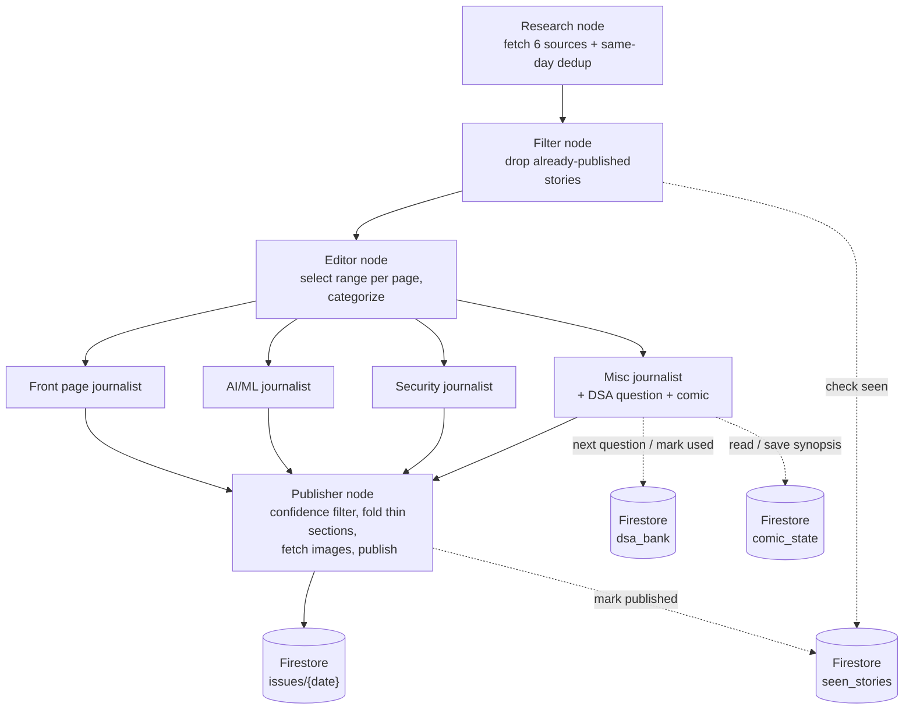

# AGENTS.md — The Kernel Gazette

**Motto: "All the Bits Fit to Print."**

## What this project is

A personal daily tech newspaper. Every morning at 6:30am, an agent researches yesterday's
tech news, writes it up in newspaper style across four pages, and publishes it. You open one
browser tab with your morning tea and read a fresh issue — no feed, no algorithm, no scrolling.

The backend is a LangGraph agent graph (Python) that does the reporting. Firebase Firestore
is the newsroom's filing cabinet — it's both the output store and the only way state persists
between runs (what's already been published, what DSA question comes next, where the comic
strip's story left off). The frontend is a React+Vite app that just reads today's issue live
from Firestore and lays it out like a paper.

If you're an agent picking up work in this repo: read the graph flow below before touching
any node, the pieces are more interdependent than they look from the file tree.

```
kernel-gazette/
  backend/
    agent/
      core/
        config.py             # task -> (provider, model) map, ProviderConfig, resolve_config()
        llm.py                 # provider-agnostic call_llm(), see Provider abstraction below
      schema/
        __init__.py            # re-exports all pydantic models
        story.py               # Story, Categorized
        issue.py               # Issue, IssueSection, ArticleItem, DSAItem, ComicItem, Item
      graph/
        __init__.py            # re-exports build_graph, build_initial_state, GazetteState
        state.py               # shared GazetteState TypedDict; build_initial_state()
        graph.py               # StateGraph assembly + fan-out/fan-in edges
nodes/
        __init__.py            # re-exports each node entrypoint
        research.py            # parallel fan-out across source tools + same-day merge/cluster
        filter.py               # drops stories already published on a prior day
        editor.py               # selects a range per page, categorizes
        journalist.py           # build_journalist(page): one node body per page bucket
        publisher.py            # confidence filter, thin-section handling, images, Firestore write
      tools/
        __init__.py             # re-exports SourceRecord + fetch_all_sources
        base.py                 # shared HTTP helpers + SourceRecord
        sources.py              # fetch_all_sources(): runs all 6 in parallel
        hacker_news.py reddit.py devto.py github.py techcrunch.py theverge.py
        search_tool.py          # journalist fallback only (Phase 5)
        image_search_tool.py     # publisher-only (Phase 6)
    firebase/
      __init__.py               # re-exports all accessors
      firebase.py               # the ONLY module importing firebase_admin; exports firebase/firestore/db + story_hash
      seen.py                   # seen_stories: get_seen, mark_published
      issues.py                 # issues: read_issue, write_issue
      dsa.py                    # dsa_bank: get_next_dsa_question, mark_dsa_used
      comic.py                  # comic_state: get_comic_state, save_comic_state
    fixtures/                   # seed data (Phase 2)
      dsa_bank.json             # 25 DSA questions
      comic_state.json          # starting comic storyline
      issue.json                # hand-written sample issue (date filled at seed-time)
    seed.py                     # one-off: bulk-load fixtures into Firestore (not a node)
    run.py                     # entrypoint: builds graph, invokes it
    kernel-gazette.timer       # systemd timer (6:30am daily)
    kernel-gazette.service     # systemd service, calls run.py
    pyproject.toml
  frontend/
    src/
      components/
        Masthead.jsx                # "The Kernel Gazette" + motto + date
        Section.jsx
        StoryCard.jsx
        DsaBox.jsx                  # renders a dsa_question item differently from an article
        ComicPanel.jsx              # renders a comic item differently from an article
        FrontPage.jsx
      firebase.js                   # SDK init + subscribeToIssue(date), the only Firestore touchpoint
      App.jsx                       # subscribes, renders sections, handles missing/thin sections
      main.jsx
      dummyData/
        sampleIssue.js              # mock issue matching the Firestore shape, for early frontend work
    package.json
    vite.config.js
  AGENTS.md
  plan.md
```

## Architecture



Linear spine is Research → Filter → Editor → Publisher; the four journalists are a parallel
fan-out/fan-in between Editor and Publisher. Firestore is touched at four points, each by
exactly one node: Filter reads `seen_stories`, Misc journalist owns `dsa_bank` and
`comic_state`, and Publisher is the only writer of `issues` and `seen_stories`. No other node
should reach into Firestore — if you find yourself adding a Firestore call somewhere else in
the graph, that's a sign the logic belongs in one of these four instead.

## The graph, in order

**Research node** — parallel tool calls across all 6 sources. Its second job, not just
fetching: merge same-story-multiple-sources into one record before anything downstream sees
it (`cluster_sources: [str]` on the merged record). This is same-day dedup — different outlets
covering one event today. Output: `raw_stories: List[dict]`.

**Filter node** — a pure Firestore lookup, no LLM call. For each raw story, check its
canonical URL/hash against `seen_stories`; drop anything already published on a prior day.
This is cross-day dedup, a different concern from Research node's same-day merge — don't
combine the two. Output: `fresh_stories: List[dict]`.

**Editor node** — the only node that makes editorial judgment calls. Selects a **target
range** per page (not a fixed count — e.g. 3–10), categorizes into `front_page`, `aiml_page`,
`security_page`, `misc_page`. Never pads to hit a number; if a day is thin, it stays thin here
and gets handled downstream. Output: `categorized: Dict[str, List[dict]]`.

**Journalist nodes** (parallel, one per page) — each writes full article text for its
assigned stories, and emits `confidence_rating` and `importance_rating` per article. Each
calls the Internet Search tool only if the Research node's snippet doesn't give enough to
write from — not automatically per article, that's a cost control as much as a quality one.

- **Misc journalist** has two extra jobs beyond regular articles: the daily DSA question and
  the tech comic. Both need continuity across days, so it reads/writes two dedicated Firestore
  collections (see Data model) that no other node touches:
  - `get_next_dsa_question()` / `mark_dsa_used(id)` against `dsa_bank`
  - `get_comic_state()` / `save_comic_state(synopsis)` against `comic_state`, so the strip
    continues its story instead of restarting each day.

**Publisher node** — the only node allowed to write to Firestore, and the only one allowed to
call the Image Search tool.
- Drops any article below the confidence threshold.
- Handles thin sections: if a page falls below a viable minimum after filtering, its
  leftover articles get folded into Misc rather than shipping a near-empty page.
- Fetches images only for articles above the importance threshold.
- Writes the finished issue to `issues/{date}` and marks today's published stories in
  `seen_stories`.

## Data model (Firestore)

**`issues/{date}`** — one doc per day, what the frontend subscribes to.
```json
{
  "date": "2026-07-24",
  "sections": [
    {
      "name": "Front page",
      "items": [
        {
          "id": "abc123",
          "type": "article",
          "headline": "string",
          "body": "journalist-written text",
          "sources": ["Ars Technica", "The Verge"],
          "confidence_rating": 0.91,
          "importance_rating": 8.4,
          "image_url": "https://... or null"
        }
      ]
    },
    {
      "name": "Misc",
      "items": [
        { "id": "dsa-042", "type": "dsa_question", "prompt": "...", "difficulty": "medium" },
        { "id": "comic-017", "type": "comic", "image_url": "...", "caption": "..." }
      ]
    }
  ]
}
```
Note the `type` field on every item — the frontend renders `article`, `dsa_question`, and
`comic` differently. A page can be entirely absent from `sections` on a thin day; the
frontend must handle that, not assume all four pages always exist.

**`seen_stories/{hash}`** — one doc per published story, Filter node's only input.
```json
{ "url": "https://...", "published_date": "2026-07-24" }
```

**`dsa_bank/{id}`** — pre-seeded question bank, Misc journalist's rotation source.
```json
{ "prompt": "string", "difficulty": "easy|medium|hard", "used": false }
```

**`comic_state`** — single doc, the ongoing storyline.
```json
{ "arc_name": "string", "day_number": 12, "last_synopsis": "string", "characters": ["..."] }
```

Keep all four collections this simple. No user accounts, no subcollections — this is a
single-reader project.

---

## Backend (`backend/`)

**Stack:** Python 3.11, LangGraph, `uv` for packages. Firebase Admin SDK for Firestore, all
access through `backend/firebase/` — and within it, only `firebase/firebase.py` imports
`firebase_admin`.

### Package layout

- **`agent/core/`** — infrastructure. `config.py` (task → provider/model map, `ProviderConfig`,
  `resolve_config()`) and `llm.py` (`call_llm`); both provider-agnostic as far as nodes are
  concerned.
- **`agent/schema/`** — every pydantic model. Nodes/state read shapes from here; nothing else
  defines structured data. `story.py` (`Story`, `Categorized`), `issue.py` (`Issue`,
  `IssueSection`, `ArticleItem`/`DSAItem`/`ComicItem`).
- **`agent/graph/`** — LangGraph. `state.py` (`GazetteState` TypedDict + `build_initial_state`),
  `graph.py` (StateGraph edges, the stable topology). **Do not edit routing per-phase; nodes
  swap in without changing topology.**
- **`agent/nodes/`** — one file per node. Journalists share `journalist.py` via
  `build_journalist(page)` so four buckets reuse one body (Misc gets extra DSA/comic handling —
  no separate per-page files).
- **`firebase/`** — the filing cabinet. `firebase.py` is the single `firebase_admin` import,
  exposing `firebase`, `firestore`, `db()`, `story_hash()`. Per-collection modules:
  `seen.py`, `issues.py`, `dsa.py`, `comic.py`.

### Provider abstraction

Every LLM call goes through `agent/core/llm.py`:
```python
def call_llm(prompt: str, *, task: str, model: str | None = None, system: str | None = None) -> str:
    ...
```
`task` is one of `"research"`, `"edit"`, `"write"`, `"rate"`. `agent/core/config.py` maps each
task to a default provider. Providers: **Gemini** (Flash-Lite, free tier — good default for
research/rating), **OpenAI**, **Anthropic (Claude Haiku)**, **Ollama Cloud** (a hosted API,
not a local model — treat it like any other entry in this table, no RAM implications).

### Node rules

- Same-day dedup lives in Research node. Cross-day repeat-check lives in Filter node. Don't
  merge these into one step, they answer different questions.
- Editor node is the only place "what matters, what page" gets decided.
- Journalists only call the search tool when the Research snippet is insufficient — define
  that concretely (e.g. under N words, or missing a fact the write prompt needs) rather than
  leaving it to vibes.
- Only Misc journalist touches `dsa_bank` and `comic_state`. Only Publisher node touches
  `issues` and `seen_stories`.
- Publisher node's thin-section handling (fold into Misc) is the only place page structure
  changes after Editor node's initial categorization — journalists shouldn't reassign pages.

### Running it

```
uv run backend/run.py            # single run, writes today's issue to Firestore
uv run backend/run.py --dry-run  # research -> filter -> editor only, prints to stdout,
                                    # skips journalist/publisher LLM + image spend
```

`kernel-gazette.service` + `.timer` wire this into systemd for the 6:30am run.

### Things not to do

- Don't fabricate stories to hit a page's target range — thin days stay thin, that's Publisher
  node's job to handle gracefully, not Editor's or a journalist's job to paper over.
- Don't call the search tool unconditionally per article.
- Don't write to Firestore from anywhere except Publisher node (and Misc journalist's two
  dedicated collections, which are reads/writes scoped to just those two tools). Any new
  Firestore read/write belongs in `firebase/`, splitting the *collection* onto its own module.
- Don't add a local/downloaded model dependency — every provider, Ollama Cloud included, is
  a hosted API call.

---

## Frontend (`frontend/`)

**Stack:** React + Vite. No Next.js, no routing, no SSR — one page, live-updating from
Firestore via the client SDK, no rebuild needed for new content.

### Component rules

- `firebase.js` is the only file touching Firestore — `subscribeToIssue(date)` using
  `onSnapshot` so the page updates without a manual refresh.
- `App.jsx` subscribes, holds the issue in state, passes sections down as props. It must
  handle a `sections` array that doesn't always contain all four pages (thin-day omission)
  and render nothing broken when one's missing.
- `StoryCard.jsx` renders `type: "article"` items. `DsaBox.jsx` and `ComicPanel.jsx` handle
  their respective `type` values — dispatch on `item.type` in `Section.jsx`, don't force every
  item through `StoryCard`.
- `Masthead.jsx` owns "The Kernel Gazette" + "All the Bits Fit to Print." + the date — keep
  the motto here, not duplicated elsewhere.
- `dummyData/sampleIssue.js` should include at least one `dsa_question` and one `comic` item,
  and one page intentionally omitted, so early frontend work already handles these cases
  instead of discovering them later.

### Running it

```
npm install
npm run dev        # point at dummyData first, then live Firestore
npm run preview      # serves dist/ on localhost:4173 — pin your morning tab here
```

### Things not to do

- Don't call any LLM, source API, or search tool from the frontend.
- Don't add global state management for a single live-updating document.
- Don't assume every section or every item type is always present — the whole point of the
  thin-section design is that some days it isn't.